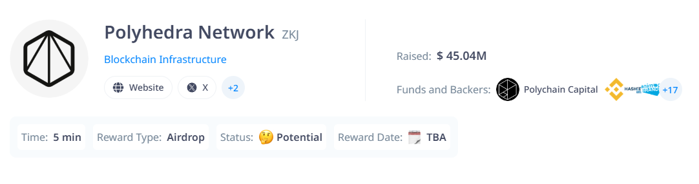

# Exp Chain Auto Deploy Contract



Introducing EXPchain
The Future of Intelligence • Inventor of zkBridge and Expander • EXPchain: The everything chain for AI
- Website: https://www.polyhedra.network/
- Twitter: [@PolyhedraZK](https://x.com/PolyhedraZK)


## Features

- **Auto Getting Faucets**
- **Auto Deploy Contract**
- **Auto Interact with Contract**
- **Auto Generate New Wallets**
- **All Wallets informations saved to wallets.json**


## Requirements

- **Node.js**: Ensure you have Node.js installed.
- **npm**: Ensure you have npm installed.
- **Api key To solve captcha**: you need captcha apikey to get faucet
- **Anti-captcha** https://anti-captcha.com/clients/settings/apisetup
- **2Captcha** https://2captcha.com/enterpage

## Setup

1. Clone this repository:
   ```bash
   git clone https://github.com/Zlkcyber/expchain.git
   cd expchain
   ```
2. Install dependencies:
   ```bash
   npm install
   ```
3. Setup: to creating new wallets
   ```bash
   npm run setup
   ```
4. Faucet: to getting faucet
   ```bash
   npm run faucet
   ```
5. Run The Script:
   ```bash
   npm run start
   ```


## 

This project is licensed under the [MIT License](LICENSE).
